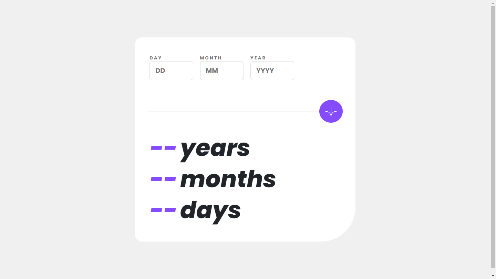

# Frontend Mentor - Age calculator app solution

This is a solution to the [Age calculator app challenge on Frontend Mentor](https://www.frontendmentor.io/challenges/age-calculator-app-dF9DFFpj-Q). Frontend Mentor challenges help you improve your coding skills by building realistic projects. 

## Table of contents

- [Overview](#overview)
  - [The challenge](#the-challenge)
  - [Screenshot](#screenshot)
  - [Links](#links)
- [My process](#my-process)
  - [Built with](#built-with)
  - [Continued development](#continued-development)
  - [Useful resources](#useful-resources)
- [Author](#author)

## Overview

### The challenge

Users should be able to:

- View an age in years, months, and days after submitting a valid date through the form
- Receive validation errors if:
  - Any field is empty when the form is submitted
  - The day number is not between 1-31
  - The month number is not between 1-12
  - The year is in the future
  - The date is invalid e.g. 31/04/1991 (there are 30 days in April)
- View the optimal layout for the interface depending on their device's screen size
- See hover and focus states for all interactive elements on the page
- **Bonus**: 
  - See the age numbers animate to their final number when the form is submitted
  - Receive a birthday greeting if the user's birthday falls on this day.

### Screenshot

### Links

- Solution URL: [Github Repository](https://github.com/praveenkumar-11/Age-Calculator)
- Live Site URL 1: [Cloudflare](https://age-calculator-axi.pages.dev/)
- Live Site URL 2: [Github Pages](https://praveenkumar-11.github.io/Age-Calculator/)

## My process

### Built with

- Semantic HTML5 markup
- SCSS custom properties
- Flexbox
- Mobile-first workflow
- [Bootstrap 5](https://getbootstrap.com/) - CSS Framework

### Continued development

I've put my all into creating this age calculator app.I tested it and discovered that it was operating properly.Please rise an issue if you discover any mistakes or incorrect responses.I appreciate your cooperation.

### Useful resources

- [Javascript Date Reference](https://www.w3schools.com/jsref/jsref_obj_date.asp) - I refered this page to learn more about Date methods in javascript. I really liked this pattern and will use it going forward.

## Author

- Frontend Mentor - [@praveenkumar-11](https://www.frontendmentor.io/profile/praveenkumar-11)